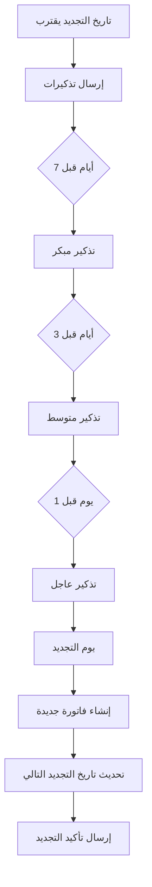
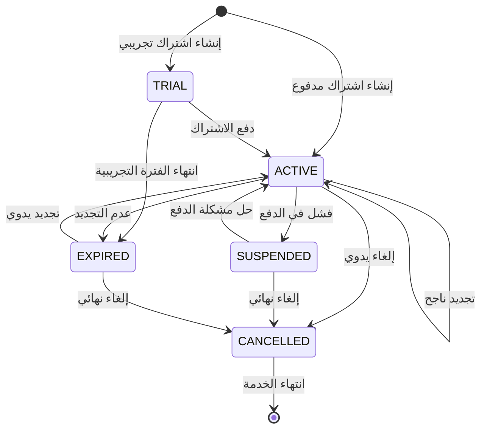

# 🔄 **دليل شامل لنظام التجديد وخطط الاشتراك**

## 🎯 **نظرة عامة**

نظام متكامل لإدارة اشتراكات الشركات مع تجديد تلقائي وإشعارات ذكية وإدارة مرنة للخطط.

---

## 💰 **خطط الاشتراك المتاحة**

### 📊 **الخطط الثلاث الرئيسية:**

| الخطة | السعر الشهري | السعر السنوي | الوفر السنوي | الميزات |
|-------|-------------|-------------|-------------|---------|
| **🟢 BASIC** | 2,500 ج.م | 27,000 ج.م | 3,000 ج.م (10%) | ميزات أساسية |
| **🔵 PRO** | 7,500 ج.م | 81,000 ج.م | 9,000 ج.م (10%) | ميزات متقدمة |
| **🟣 ENTERPRISE** | 15,000 ج.م | 162,000 ج.م | 18,000 ج.م (10%) | ميزات شاملة |

### 🎁 **مزايا إضافية:**
- **فترة تجريبية مجانية:** 7-30 يوم حسب الخطة
- **خصم سنوي:** 10% عند الدفع السنوي
- **مرونة في التغيير:** ترقية أو تخفيض في أي وقت
- **دعم فني:** متدرج حسب نوع الخطة

---

## 🔄 **نظام التجديد التلقائي**

### ⚙️ **كيف يعمل التجديد:**

#### 1. **الإعداد الأولي:**
```javascript
// عند إنشاء اشتراك جديد
{
  planType: 'PRO',           // نوع الخطة
  billingCycle: 'monthly',   // دورة الفوترة
  price: 7500,               // السعر
  autoRenew: true,           // التجديد التلقائي مفعل
  nextBillingDate: '2025-09-12', // تاريخ التجديد التالي
  startDate: '2025-08-12',   // تاريخ البداية
  status: 'ACTIVE'           // الحالة
}
```

#### 2. **دورات الفوترة المتاحة:**

| الدورة | المدة | التكرار | الاستخدام |
|--------|-------|---------|----------|
| **monthly** | شهر واحد | كل 30 يوم | الأكثر شيوعاً |
| **yearly** | سنة كاملة | كل 365 يوم | خصم 10% |
| **quarterly** | 3 شهور | كل 90 يوم | توازن مثالي |
| **weekly** | أسبوع واحد | كل 7 أيام | للاختبارات |

#### 3. **عملية التجديد التلقائي:**



---

## 📅 **جدولة الإشعارات**

### ⏰ **التوقيتات:**
- **فحص يومي:** 9:00 صباحاً (توقيت القاهرة)
- **فحص أسبوعي:** الاثنين 10:00 صباحاً

### 📧 **أنواع الإشعارات:**

#### 1. **تذكيرات التجديد:**
- **7 أيام قبل:** "اشتراكك سينتهي خلال أسبوع"
- **3 أيام قبل:** "اشتراكك سينتهي خلال 3 أيام"
- **1 يوم قبل:** "اشتراكك سينتهي غداً"

#### 2. **إشعارات التجديد:**
- **تأكيد التجديد:** "تم تجديد اشتراكك بنجاح"
- **فاتورة جديدة:** "فاتورة جديدة متاحة للدفع"
- **فشل التجديد:** "فشل في تجديد الاشتراك"

---

## 🎛️ **حالات الاشتراك**

### 📊 **دورة حياة الاشتراك:**



### 🏷️ **شرح الحالات:**

| الحالة | الوصف | الإجراءات المتاحة |
|--------|-------|------------------|
| **🟢 ACTIVE** | اشتراك نشط وفعال | تجديد، إلغاء، تعديل |
| **🔵 TRIAL** | فترة تجريبية | تفعيل، إلغاء |
| **🟡 INACTIVE** | متوقف مؤقتاً | إعادة تفعيل، إلغاء |
| **🔴 CANCELLED** | ملغي نهائياً | عرض فقط |
| **⚫ EXPIRED** | منتهي الصلاحية | تجديد، إلغاء |
| **🟠 SUSPENDED** | معلق لمشاكل دفع | حل المشكلة، إلغاء |

---

## 🛠️ **إدارة التجديد من الواجهة**

### 📋 **خيارات التجديد اليدوي:**

#### 1. **تجديد عادي:**
- يحافظ على نفس الخطة والسعر
- يحدث في تاريخ التجديد المحدد
- ينشئ فاتورة جديدة تلقائياً

#### 2. **تجديد فوري:**
- يحدث فوراً بغض النظر عن التاريخ
- مفيد للاشتراكات المنتهية
- يعيد تعيين دورة الفوترة

#### 3. **تجديد مع تعديل:**
- تغيير نوع الخطة (ترقية/تخفيض)
- تعديل السعر المخصص
- تغيير دورة الفوترة

### 🎯 **خطوات التجديد من الواجهة:**

1. **انتقل لصفحة الاشتراكات**
2. **اختر الاشتراك المطلوب**
3. **اضغط على زر "تجديد" 🔄**
4. **اختر الخيارات:**
   - نوع الخطة الجديدة
   - دورة الفوترة
   - السعر المخصص (اختياري)
   - تجديد فوري أم لا
5. **اضغط "تجديد الاشتراك"**

---

## 💡 **ميزات متقدمة**

### 🔧 **التخصيص:**
- **أسعار مخصصة:** لعملاء مميزين
- **دورات فوترة مرنة:** حسب احتياجات العميل
- **خصومات خاصة:** للعقود طويلة المدى

### 📊 **التتبع والإحصائيات:**
- **معدل التجديد:** نسبة الاشتراكات المجددة
- **الإيرادات المتوقعة:** حسب الاشتراكات النشطة
- **تحليل الإلغاءات:** أسباب عدم التجديد

### 🚨 **إدارة المخاطر:**
- **تنبيهات الدفع الفاشل:** إشعارات فورية
- **محاولات متعددة:** 3 محاولات قبل التعليق
- **خطط الاسترداد:** لاستعادة العملاء المفقودين

---

## 🧪 **أمثلة عملية**

### 📝 **مثال 1: تجديد شهري عادي**
```javascript
// اشتراك PRO شهري
{
  planType: 'PRO',
  billingCycle: 'monthly',
  price: 7500,
  nextBillingDate: '2025-09-12'
}

// بعد التجديد التلقائي
{
  planType: 'PRO',
  billingCycle: 'monthly', 
  price: 7500,
  nextBillingDate: '2025-10-12' // +1 شهر
}
```

### 📝 **مثال 2: ترقية مع التجديد**
```javascript
// من BASIC إلى PRO
{
  planType: 'BASIC',     // كان
  price: 2500,
  billingCycle: 'monthly'
}

// بعد الترقية
{
  planType: 'PRO',       // أصبح
  price: 7500,           // سعر جديد
  billingCycle: 'monthly',
  immediate: true        // تجديد فوري
}
```

### 📝 **مثال 3: تحويل لسنوي مع خصم**
```javascript
// من شهري إلى سنوي
{
  planType: 'PRO',
  billingCycle: 'monthly',  // كان
  price: 7500
}

// بعد التحويل
{
  planType: 'PRO',
  billingCycle: 'yearly',   // أصبح
  price: 81000,             // 7500 × 12 - 10% خصم
  nextBillingDate: '2026-08-12' // +1 سنة
}
```

---

## 🔍 **استكشاف الأخطاء**

### ❌ **مشاكل شائعة وحلولها:**

#### 1. **فشل التجديد التلقائي:**
- **السبب:** مشكلة في طريقة الدفع
- **الحل:** تحديث بيانات الدفع أو تجديد يدوي

#### 2. **عدم وصول الإشعارات:**
- **السبب:** بريد إلكتروني خاطئ
- **الحل:** تحديث بيانات الاتصال

#### 3. **اشتراك معلق:**
- **السبب:** فشل متكرر في الدفع
- **الحل:** حل مشكلة الدفع وإعادة التفعيل

### 🛠️ **أدوات الصيانة:**
- **إعادة تشغيل التجديد:** للاشتراكات المعلقة
- **تصحيح التواريخ:** لحل مشاكل التوقيت
- **مزامنة البيانات:** بين الاشتراك والفواتير

---

## 📈 **أفضل الممارسات**

### ✅ **للإدارة:**
1. **مراقبة يومية:** تحقق من حالة التجديدات
2. **متابعة الإشعارات:** تأكد من وصولها للعملاء
3. **تحليل الاتجاهات:** راقب معدلات التجديد والإلغاء

### ✅ **للعملاء:**
1. **تحديث البيانات:** حافظ على بيانات الدفع محدثة
2. **مراقبة الإشعارات:** انتبه لتذكيرات التجديد
3. **التخطيط المسبق:** فكر في الترقية أو التخفيض

---

## 🎯 **الخلاصة**

نظام التجديد وخطط الاشتراك يوفر:

✅ **مرونة كاملة** في إدارة الاشتراكات  
✅ **تجديد تلقائي** موثوق ومضمون  
✅ **إشعارات ذكية** لتجنب انقطاع الخدمة  
✅ **خيارات متنوعة** للخطط والأسعار  
✅ **إدارة سهلة** من واجهة واحدة  
✅ **تتبع شامل** للإيرادات والإحصائيات  

**النظام جاهز للاستخدام الفوري! 🚀**
