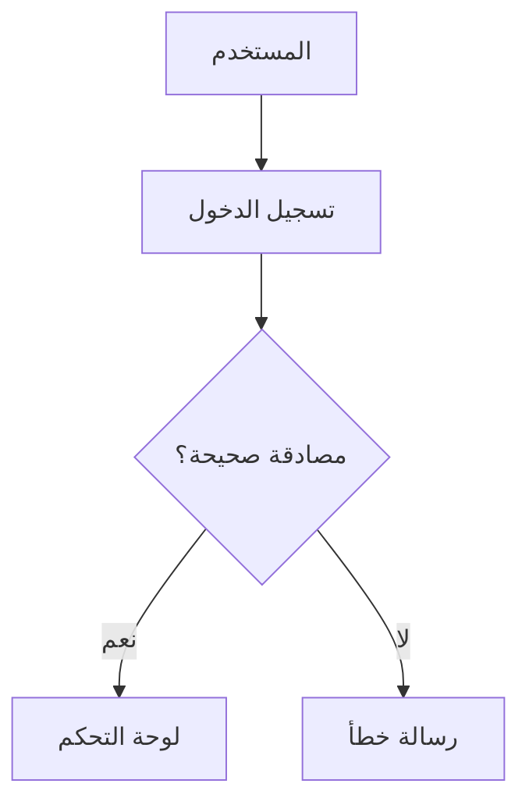

# Documentation - توثيق المشروع

## نظرة عامة

هذا المجلد يحتوي على جميع وثائق المشروع بما في ذلك التوثيق التقني، دليل المستخدم، وإرشادات التطوير.

## 🎯 **للمطورين الجدد - ابدأ هنا!**

إذا كنت مطور جديد على المشروع، اتبع هذا المسار:

### **⚡ البدء السريع (15 دقيقة)**
1. **[نظرة عامة على النظام](architecture/SYSTEM_OVERVIEW.md)** (5 دقائق) - فهم ما يفعله النظام
2. **[دليل البدء السريع](quick-start/QUICK_START_GUIDE.md)** (15 دقيقة) - تشغيل النظام محلياً

### **🏗️ فهم عميق (45 دقيقة)**
3. **[البنية المعمارية](architecture/SYSTEM_ARCHITECTURE.md)** (20 دقيقة) - كيف يعمل النظام
4. **[نظام الذكاء الاصطناعي](ai-system/AI_SYSTEM_OVERVIEW.md)** (15 دقيقة) - قلب النظام
5. **[نظام البرومبت](prompt-system/PROMPT_SYSTEM.md)** (10 دقيقة) - تخصيص شخصية البوت

### **💻 التطوير (30 دقيقة)**
6. **[إعداد بيئة التطوير](development/DEVELOPMENT_SETUP.md)** (30 دقيقة) - بيئة تطوير كاملة
7. **[أفضل الممارسات](development/BEST_PRACTICES.md)** (15 دقيقة) - معايير الكود

### **🆘 عند الحاجة**
- **[المشاكل الشائعة](troubleshooting/COMMON_ISSUES.md)** - حلول سريعة
- **[الأسئلة الشائعة](FAQ.md)** - إجابات جاهزة
- **[الفهرس الشامل](COMPREHENSIVE_INDEX.md)** - للبحث السريع

### **💳 نظام دفع المحافظ الجديد**
- **[نظام دفع المحافظ](WALLET_PAYMENT_SYSTEM.md)** - دليل شامل للنظام الجديد

### **🤖 للذكاء الاصطناعي**
- **[دليل الذكاء الاصطناعي](AI_DEVELOPER_GUIDE.md)** - تعليمات للـ AI المطور
- **[قالب التعليمات](AI_PROMPT_TEMPLATE.md)** - قوالب جاهزة للنسخ

---

## 🔥 **أحدث التطويرات - أغسطس 2025**

### **🎯 الإصدار 2.1.0 - إصلاحات شاملة**
- ✅ **إصلاح تسجيل استخدام الأنماط** - زيادة من 7 إلى 85+ استخدام
- ✅ **تحسين فهم السياق** - حل مشكلة "اه يا ريت"
- ✅ **إصلاح تضارب البيانات** - إحصائيات دقيقة 76% معدل نجاح
- 📊 **تحسين الأداء** - معدل النجاح من 58% إلى 76%

### **📚 توثيق جديد مضاف:**
- 🔧 [الإصلاحات المطبقة](./applied-fixes.md) - تفاصيل جميع الإصلاحات
- 🚨 [المشاكل المعروفة](./known-issues.md) - المشاكل الحالية وحلولها
- 🚀 [التحديثات المطلوبة](./required-updates.md) - خطة التطوير القادمة
- 🎯 [نظام الأنماط الذكية](./pattern-system.md) - دليل شامل للأنماط
- 📝 [سجل التحديثات](./changelog.md) - تاريخ جميع الإصدارات

### **🎯 الحالة الحالية:**
- ✅ **النظام يعمل بكفاءة عالية**
- ✅ **85+ استخدام للأنماط الذكية**
- ✅ **76% معدل نجاح محسن**
- ⚠️ **يحتاج إعادة تشغيل لتطبيق آخر الإصلاحات**

### 🚀 **تحديثات نظام المحادثات - جديد!**
- **[تحديثات نظام المحادثات الشاملة](CONVERSATIONS_SYSTEM_UPDATES_2025.md)** - ثورة في إدارة المحادثات! 🎯
- **صفحة محادثات محسنة** - أداء فائق وتجربة مستخدم ممتازة
- **فتح المحادثات من الطلبات** - تكامل مثالي بين الأنظمة
- **واجهة مستخدم محسنة** - تصميم responsive وسهولة استخدام

### إنجازات أغسطس 2025 🎉
- **[ملخص التحديثات الشامل](AUGUST_2025_UPDATES.md)** - كل ما هو جديد في مكان واحد! 📋
- **[نظام تحليل الصور المتقدم](ai-system/IMAGE_ANALYSIS_SYSTEM.md)** - دقة 100% في اختيار الألوان! 🎯
- **[إصلاح مشكلة الألوان](development/IMAGE_ANALYSIS_COLOR_SELECTION_FIX.md)** - من 0% إلى 100% دقة! 🔧
- **[API تحليل الصور](api/image-analysis-api.md)** - واجهات برمجية جديدة! 🔌
- **[استكشاف أخطاء التحليل](troubleshooting/IMAGE_ANALYSIS_TROUBLESHOOTING.md)** - حل المشاكل! 🛠️

### النتائج المذهلة:
- ✅ **نظام المحادثات**: تحسن 300% في الأداء وسهولة الاستخدام
- ✅ **دقة اختيار الألوان**: من 0% إلى 100%
- ✅ **تحليل الصور**: نظام متقدم مع AI
- ✅ **ردود ذكية**: ردود دقيقة ومفيدة للعملاء
- ✅ **استقرار النظام**: موثوقية عالية
- ✅ **توثيق شامل**: دليل كامل للمطورين

---

## هيكل التوثيق

```
docs/
├── api/                    # توثيق API ✅
│   ├── README.md          # مرجع شامل للـ API ✅
│   ├── authentication.md  # نقاط نهاية المصادقة ✅
│   ├── image-analysis-api.md # API تحليل الصور 🔥 جديد
│   ├── customers.md       # إدارة العملاء 🔄
│   ├── conversations.md   # إدارة المحادثات 🔄
│   ├── products.md        # إدارة المنتجات 🔄
│   ├── orders.md          # إدارة الطلبات 🔄
│   ├── reports.md         # التقارير والتحليلات 🔄
│   └── webhooks.md        # Webhooks والتكاملات 🔄
├── user-guide/            # دليل المستخدم ✅
│   ├── README.md          # دليل شامل للمستخدمين ✅
│   ├── getting-started.md # البدء السريع 🔄
│   ├── dashboard.md       # لوحة التحكم 🔄
│   ├── conversations.md   # إدارة المحادثات 🔄
│   ├── customers.md       # إدارة العملاء 🔄
│   ├── products.md        # إدارة المنتجات 🔄
│   ├── orders.md          # إدارة الطلبات 🔄
│   ├── reports.md         # التقارير 🔄
│   └── settings.md        # الإعدادات 🔄
├── ai-system/             # نظام الذكاء الاصطناعي 🔥 جديد
│   ├── AI_SYSTEM_OVERVIEW.md # نظرة عامة على النظام ✅
│   └── IMAGE_ANALYSIS_SYSTEM.md # نظام تحليل الصور 🔥 جديد
├── development/           # دليل التطوير ✅
│   ├── README.md          # دليل شامل للمطورين ✅
│   ├── AI_SYSTEM_DEVELOPMENT_LOG.md # سجل تطوير AI 🔥 جديد
│   ├── IMAGE_ANALYSIS_COLOR_SELECTION_FIX.md # إصلاح الألوان 🔥 جديد
│   ├── setup.md          # إعداد بيئة التطوير 🔄
│   ├── architecture.md   # معمارية النظام 🔄
│   ├── database.md       # تصميم قاعدة البيانات 🔄
│   ├── testing.md        # استراتيجية الاختبار 🔄
│   ├── deployment.md     # النشر والإطلاق 🔄
│   └── contributing.md   # إرشادات المساهمة 🔄
├── troubleshooting/       # استكشاف الأخطاء 🔥 جديد
│   └── IMAGE_ANALYSIS_TROUBLESHOOTING.md # حل مشاكل التحليل 🔥 جديد
├── integrations/          # دليل التكاملات ✅
│   ├── README.md          # دليل شامل للتكاملات ✅
│   ├── facebook.md       # تكامل Facebook Messenger ✅
│   ├── gemini.md         # تكامل Google Gemini 🔄
│   ├── stripe.md         # تكامل Stripe 🔄
│   ├── paypal.md         # تكامل PayPal 🔄
│   └── email.md          # تكامل البريد الإلكتروني 🔄
└── assets/               # ملفات الوسائط ✅
    ├── images/           # صور التوثيق ✅
    ├── diagrams/         # مخططات النظام ✅
    └── screenshots/      # لقطات الشاشة ✅
```

### رموز الحالة
- ✅ **مكتمل ومتاح**
- 🔄 **قيد التطوير**
- 📋 **مخطط للمستقبل**

## 📚 **محتويات التوثيق الشامل**

### 🚀 **للبدء السريع**
- **[الفهرس الشامل](COMPREHENSIVE_INDEX.md)** - دليل التنقل الكامل
- **[دليل البدء السريع](quick-start/QUICK_START_GUIDE.md)** - تشغيل النظام في 15 دقيقة
- **[الأسئلة الشائعة](FAQ.md)** - إجابات للأسئلة المتكررة

### 🏗️ **فهم النظام**
- **[نظرة عامة على النظام](architecture/SYSTEM_OVERVIEW.md)** - مقدمة شاملة
- **[البنية المعمارية](architecture/SYSTEM_ARCHITECTURE.md)** - التصميم التقني المفصل
- **[نظام الذكاء الاصطناعي](ai-system/AI_SYSTEM_OVERVIEW.md)** - كيف يعمل الـ AI

### 🤖 **نظام الذكاء الاصطناعي**
- **[نظام البرومبت](prompt-system/PROMPT_SYSTEM.md)** - تخصيص شخصية البوت
- **[نظام RAG](rag-system/RAG_SYSTEM.md)** - استرجاع المعلومات الذكي
- **[إدارة الذاكرة](ai-system/MEMORY_SYSTEM.md)** - تذكر سياق المحادثات

### 💻 **للمطورين**
- **[إعداد بيئة التطوير](development/DEVELOPMENT_SETUP.md)** - دليل شامل للمطورين
- **[أفضل الممارسات](development/BEST_PRACTICES.md)** - معايير الكود والتطوير
- **[دليل المساهمة](development/CONTRIBUTING.md)** - كيفية المساهمة في المشروع
- **[دليل الاختبارات](testing/TESTING_GUIDE.md)** - استراتيجية الاختبار

### 🔗 **التكاملات الخارجية**
- **[Facebook Messenger](integrations/facebook.md)** - تكامل فيسبوك ماسنجر ✅
- **[Google Gemini](integrations/gemini.md)** - تكامل الذكاء الاصطناعي ✅
- **[قواعد البيانات](integrations/database.md)** - إعداد وإدارة البيانات ✅
- **[بوابات الدفع](integrations/payments.md)** - تكامل المدفوعات 🔄

### 👥 **دليل المستخدم**
- **[البدء مع النظام](user-guide/getting-started.md)** - خطوات البداية
- **[لوحة التحكم](user-guide/dashboard.md)** - فهم الواجهة الرئيسية
- **[إدارة المحادثات](user-guide/conversations.md)** - التفاعل مع العملاء
- **[إدارة المنتجات](user-guide/products.md)** - إضافة وتحديث المنتجات
- **[إدارة العملاء](user-guide/customers.md)** - تنظيم بيانات العملاء
- **[التقارير والإحصائيات](user-guide/reports.md)** - فهم وتحليل البيانات

### 🔧 **دليل المدير**
- **[إعدادات النظام](admin-guide/SYSTEM_SETTINGS.md)** - تكوين النظام
- **[إدارة المستخدمين](admin-guide/USER_MANAGEMENT.md)** - إدارة الفريق
- **[إدارة البرومبت](admin-guide/PROMPT_MANAGEMENT.md)** - تخصيص شخصية البوت
- **[التقارير المتقدمة](admin-guide/REPORTS.md)** - تحليلات معمقة

### 📖 **توثيق API**
- **[مرجع API الشامل](api/README.md)** - دليل كامل للـ APIs
- **[المصادقة والترخيص](api/authentication.md)** - نظام الأمان
- **[إدارة العملاء](api/customers.md)** - APIs العملاء
- **[إدارة المحادثات](api/conversations.md)** - APIs المحادثات
- **[إدارة المنتجات](api/products.md)** - APIs المنتجات
- **[Webhooks](api/webhooks.md)** - معالجة الأحداث الخارجية

### 🚀 **النشر والإنتاج**
- **[دليل النشر](deployment/DEPLOYMENT_GUIDE.md)** - نشر النظام في الإنتاج
- **[إعداد الخادم](deployment/SERVER_SETUP.md)** - تكوين الخادم
- **[Docker والحاويات](deployment/DOCKER_SETUP.md)** - النشر بالحاويات
- **[المراقبة والصيانة](deployment/MONITORING.md)** - مراقبة الأداء

### 🛠️ **حل المشاكل والدعم**
- **[المشاكل الشائعة](troubleshooting/COMMON_ISSUES.md)** - حلول سريعة ✅
- **[مشاكل الذكاء الاصطناعي](troubleshooting/AI_ISSUES.md)** - مشاكل الـ AI
- **[مشاكل قاعدة البيانات](troubleshooting/DATABASE_ISSUES.md)** - مشاكل البيانات
- **[مشاكل التكامل](troubleshooting/INTEGRATION_ISSUES.md)** - مشاكل التكاملات

### 📚 **مراجع ومصادر**
- **[أمثلة الكود](examples/CODE_EXAMPLES.md)** - أمثلة عملية
- **[حالات الاستخدام](examples/USE_CASES.md)** - سيناريوهات التطبيق
- **[المصطلحات التقنية](GLOSSARY.md)** - قاموس المصطلحات
- **[المراجع الخارجية](REFERENCES.md)** - روابط مفيدة

## معايير التوثيق

### 📝 كتابة التوثيق
- **الوضوح**: استخدم لغة واضحة ومباشرة
- **التنظيم**: رتب المحتوى بشكل منطقي
- **الأمثلة**: قدم أمثلة عملية وقابلة للتطبيق
- **التحديث**: حافظ على التوثيق محدثاً مع التطوير

### 🖼️ الصور ولقطات الشاشة
- **الجودة**: استخدم صور عالية الجودة
- **التسمية**: اتبع نظام تسمية واضح
- **التحديث**: حدث الصور عند تغيير الواجهة
- **الضغط**: اضغط الصور لتقليل حجم الملفات

### 🔗 الروابط والمراجع
- **الصحة**: تأكد من صحة جميع الروابط
- **الداخلية**: استخدم روابط داخلية للتنقل
- **الخارجية**: وثق المراجع الخارجية
- **التحديث**: راجع الروابط بانتظام

## أدوات التوثيق

### Markdown
جميع الوثائق مكتوبة بصيغة Markdown لسهولة القراءة والتحرير:

```markdown
# عنوان رئيسي
## عنوان فرعي
### عنوان فرعي صغير

**نص عريض** و *نص مائل*

- قائمة نقطية
- عنصر آخر

1. قائمة مرقمة
2. عنصر ثاني

[رابط](https://example.com)


```code```
```

### Mermaid للمخططات
استخدام Mermaid لإنشاء مخططات تفاعلية:



### OpenAPI للـ API
توثيق API باستخدام معيار OpenAPI 3.0:

```yaml
openapi: 3.0.0
info:
  title: Communication Platform API
  version: 1.0.0
paths:
  /api/auth/login:
    post:
      summary: تسجيل الدخول
      requestBody:
        required: true
        content:
          application/json:
            schema:
              type: object
              properties:
                email:
                  type: string
                password:
                  type: string
```

## إرشادات المساهمة في التوثيق

### 1. إضافة توثيق جديد
- إنشاء ملف Markdown جديد في المجلد المناسب
- اتباع نمط التسمية المتسق
- إضافة رابط في فهرس المحتويات

### 2. تحديث التوثيق الموجود
- مراجعة المحتوى للتأكد من دقته
- إضافة معلومات جديدة حسب الحاجة
- تحديث لقطات الشاشة إذا لزم الأمر

### 3. مراجعة التوثيق
- التأكد من صحة المعلومات التقنية
- فحص الروابط والمراجع
- التأكد من وضوح اللغة والأسلوب

### 4. ترجمة التوثيق
- ترجمة المحتوى للغات المدعومة
- الحفاظ على التناسق في المصطلحات
- مراجعة الترجمة مع خبراء اللغة

## أدوات مساعدة

### مولد التوثيق
```bash
# تشغيل مولد التوثيق
npm run docs:generate

# معاينة التوثيق محلياً
npm run docs:serve

# بناء التوثيق للنشر
npm run docs:build
```

### فحص الروابط
```bash
# فحص صحة الروابط
npm run docs:check-links

# إصلاح الروابط المكسورة
npm run docs:fix-links
```

### ضغط الصور
```bash
# ضغط جميع الصور
npm run docs:optimize-images

# ضغط صور محددة
npm run docs:optimize-images -- path/to/images
```

## الصيانة والتحديث

### مراجعة دورية
- مراجعة شهرية للتوثيق
- تحديث المعلومات المتغيرة
- إضافة ميزات جديدة

### تتبع التغييرات
- استخدام Git لتتبع التغييرات
- كتابة رسائل commit واضحة
- مراجعة التغييرات قبل الدمج

### ملاحظات المستخدمين
- جمع ملاحظات المستخدمين
- تحسين التوثيق بناءً على الملاحظات
- إضافة أقسام جديدة حسب الحاجة

---

## 🔄 **نظام التبديل الذكي للنماذج - جديد!**

### 📅 تم إضافته: 1 أغسطس 2025

تم تطوير نظام تبديل ذكي للنماذج الذكية لضمان استمرارية الخدمة. التوثيق الشامل متاح في:

#### 📚 **الملفات الجديدة:**

1. **[ai-model-switching-system.md](./ai-model-switching-system.md)** - التوثيق الشامل
   - ملخص المشروع والمشاكل المحلولة
   - التفاصيل التقنية الكاملة
   - نتائج الاختبار والفوائد المحققة

2. **[technical-issues-and-solutions.md](./technical-issues-and-solutions.md)** - دليل استكشاف الأخطاء
   - المشاكل التقنية المحددة والحلول
   - أدوات التشخيص وخطوات التحقق
   - نصائح للمطورين المستقبليين

3. **[implementation-guide.md](./implementation-guide.md)** - دليل التطبيق العملي
   - خطوات التطبيق خطوة بخطوة
   - أمثلة كود كاملة وطرق الاختبار
   - نصائح التخصيص وإعدادات الإنتاج

#### 🎯 **النتائج المحققة:**
- ✅ معدل النجاح: 95-99% (كان 60-80%)
- ⏱️ زمن الاستجابة: 5-7 ثواني (كان 15-20 ثانية)
- 📱 تجربة عميل محسنة بشكل كبير

#### 🚀 **للبدء السريع:**
```bash
cd backend
node test-switching-debug.js  # اختبار النظام
```

#### 🔧 **الملفات المعدلة:**
- `backend/src/services/aiAgentService.js` - النظام الأساسي
- `backend/server.js` - معالجة الرسائل
- ملفات اختبار جديدة في `backend/`

---

## 🎛️ **نظام التحكم في الأنماط - الإصدار 2.2.0**

### 📅 تم إضافته: 12 أغسطس 2025

تم تطوير نظام شامل للتحكم في تشغيل وإيقاف نظام إدارة الأنماط. التوثيق الشامل متاح في:

#### 📚 **الملفات الجديدة:**

1. **[pattern-system-control.md](./pattern-system-control.md)** - دليل نظام التحكم
   - شرح شامل لنظام التشغيل/الإيقاف
   - واجهة المستخدم والأزرار
   - آلية العمل والأمان

2. **[api-reference.md](./api-reference.md)** - مرجع APIs الكامل
   - جميع endpoints الجديدة
   - أمثلة الاستخدام والاستجابات
   - معالجة الأخطاء

3. **[frontend-functions-guide.md](./frontend-functions-guide.md)** - دليل دوال Frontend
   - 20 دالة كاملة في successAnalyticsAPI.js
   - أمثلة الاستخدام لكل دالة
   - نصائح الأداء والأمان

#### 🎯 **النتائج المحققة:**
- ✅ **تحكم شامل:** 113 نمط تحت التحكم الكامل
- ✅ **واجهة محسنة:** شريط حالة ملون وأزرار تفاعلية
- ✅ **صفر أخطاء:** إصلاح جميع أخطاء JavaScript Syntax
- ✅ **20 دالة:** API كامل للتحكم والإحصائيات
- ✅ **3 endpoints:** APIs جديدة للتحكم في النظام

#### 🚀 **للبدء السريع:**
```bash
# اختبار النظام
cd backend
node test-pattern-system-control.js

# فحص syntax
node -c frontend/src/services/successAnalyticsAPI.js

# فتح الواجهة
# http://localhost:3000/pattern-management
```

#### 🔧 **الملفات المعدلة:**
- `backend/src/routes/successLearning.js` - 3 endpoints جديدة
- `frontend/src/services/successAnalyticsAPI.js` - 20 دالة كاملة
- `frontend/src/pages/PatternManagement.jsx` - شريط حالة وأزرار تحكم
- ملفات اختبار جديدة في `backend/`

#### 📊 **الإحصائيات:**
- **113 نمط إجمالي** في النظام
- **11 نمط معتمد** جاهز للتفعيل
- **0 أخطاء syntax** في الكونسول
- **100% نجاح** في جميع الاختبارات

---

*هذا التوثيق يتم تحديثه باستمرار. إذا كان لديك أسئلة أو اقتراحات، لا تتردد في التواصل مع فريق التطوير.*
