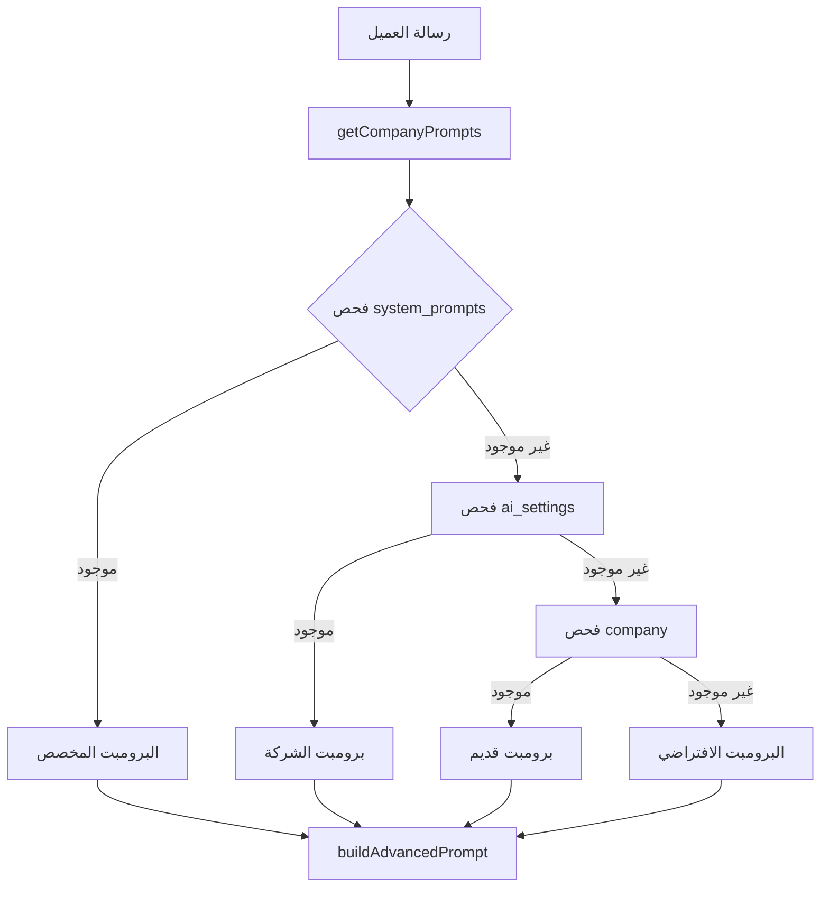
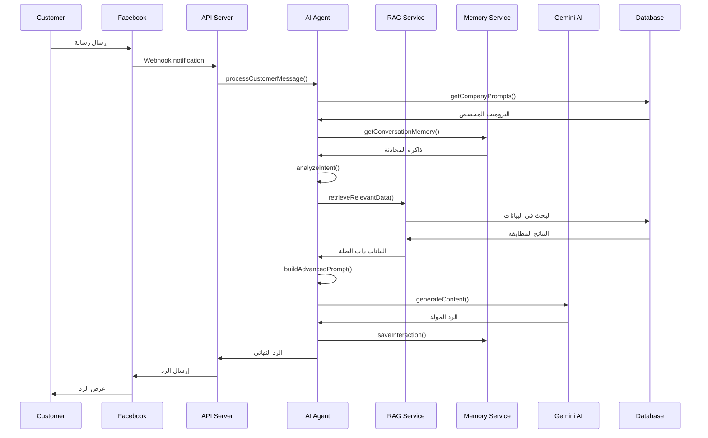

# 🤖 نظام الذكاء الاصطناعي
## AI System Comprehensive Guide

## 📋 **نظرة عامة**

نظام الذكاء الاصطناعي هو القلب النابض للمنصة، حيث يجمع بين تقنيات متقدمة لتوفير تجربة محادثة ذكية وطبيعية. النظام يستخدم **Google Gemini AI** مع تقنيات مخصصة لفهم السياق واسترجاع المعلومات.

## 🏗️ **مكونات النظام**

### **1. AI Agent Service - الخدمة الرئيسية**

```javascript
class AIAgentService {
  constructor() {
    this.systemPrompt = this.loadSystemPrompt();
    this.isEnabled = true;
    this.workingHours = { start: '09:00', end: '18:00' };
    this.maxRepliesPerCustomer = 5;
    this.multimodalEnabled = true;
    this.ragEnabled = true;
  }
}
```

#### **المسؤوليات الأساسية:**
- **معالجة الرسائل**: تحليل وفهم رسائل العملاء
- **إدارة البرومبت**: تحميل وتطبيق البرومبتات المخصصة
- **التكامل مع Gemini**: إرسال واستقبال الردود
- **إدارة الذاكرة**: حفظ واسترجاع سياق المحادثات

### **2. نظام البرومبت المخصص**

#### **هيكل البرومبت:**


#### **ترتيب الأولويات:**
1. **system_prompts** (أعلى أولوية) - البرومبت من صفحة الإدارة
2. **ai_settings** - إعدادات الذكاء الاصطناعي للشركة
3. **company** - البرومبت المحفوظ في جدول الشركة
4. **default** (أقل أولوية) - البرومبت الافتراضي

### **3. RAG System - نظام استرجاع المعلومات**

#### **مكونات RAG:**
```javascript
class RAGService {
  async retrieveRelevantData(query, intent, customerId) {
    const results = [];
    
    // البحث في المنتجات
    if (intent.includes('product') || intent.includes('price')) {
      const products = await this.searchProducts(query);
      results.push(...products);
    }
    
    // البحث في الأسئلة الشائعة
    const faqs = await this.searchFAQs(query);
    results.push(...faqs);
    
    // البحث في السياسات
    const policies = await this.searchPolicies(query);
    results.push(...policies);
    
    return results;
  }
}
```

#### **مصادر البيانات:**
- **Products**: المنتجات والمتغيرات
- **FAQs**: الأسئلة الشائعة
- **Policies**: سياسات الشركة
- **Customer History**: تاريخ العميل

### **4. Memory Service - نظام الذاكرة**

#### **أنواع الذاكرة:**
```javascript
class MemoryService {
  // الذاكرة قصيرة المدى (المحادثة الحالية)
  async getConversationMemory(conversationId, senderId, limit = 5) {
    return await prisma.conversationMemory.findMany({
      where: { conversationId, senderId },
      orderBy: { timestamp: 'desc' },
      take: limit
    });
  }
  
  // الذاكرة طويلة المدى (تاريخ العميل)
  async getCustomerHistory(customerId) {
    return await prisma.customer.findUnique({
      where: { id: customerId },
      include: { orders: true, interactions: true }
    });
  }
}
```

## 🔄 **تدفق معالجة الرسائل**

### **الخطوات التفصيلية:**



## 📝 **بناء البرومبت المتقدم**

### **مراحل البناء:**

#### **1. البرومبت الأساسي**
```javascript
// إذا وجد برومبت مخصص
if (companyPrompts.personalityPrompt) {
  prompt += `${companyPrompts.personalityPrompt}\n\n`;
} else {
  // البرومبت الافتراضي
  prompt += `أنت ساره، مساعدة مبيعات ذكية وطبيعية في متجر إلكتروني:
- تتحدثين بطريقة ودودة ومهنية
- تستخدمين اللغة العربية الواضحة
- تفهمين نية العميل قبل اقتراح المنتجات
- تقدمين معلومات دقيقة من قاعدة البيانات\n\n`;
}
```

#### **2. معلومات العميل**
```javascript
prompt += `معلومات العميل:
- الاسم: ${customerData?.name || 'عميل جديد'}
- الهاتف: ${customerData?.phone || 'غير محدد'}
- عدد الطلبات السابقة: ${customerData?.orderCount || 0}\n\n`;
```

#### **3. ذاكرة المحادثة**
```javascript
if (conversationMemory && conversationMemory.length > 0) {
  prompt += `📚 سجل المحادثة السابقة (للسياق):\n`;
  prompt += `=====================================\n`;
  
  conversationMemory.forEach((interaction, index) => {
    const timeAgo = this.getTimeAgo(new Date(interaction.timestamp));
    prompt += `${index + 1}. منذ ${timeAgo}:\n`;
    prompt += `   العميل: ${interaction.userMessage}\n`;
    prompt += `   ردك: ${interaction.aiResponse}\n\n`;
  });
  
  prompt += `=====================================\n`;
}
```

#### **4. بيانات RAG**
```javascript
if (ragData && ragData.length > 0) {
  prompt += `🗃️ المعلومات المتاحة من قاعدة البيانات:\n`;
  prompt += `=====================================\n`;
  
  ragData.forEach((item, index) => {
    if (item.type === 'product') {
      prompt += `🛍️ منتج ${index + 1}: ${item.content}\n`;
    } else if (item.type === 'faq') {
      prompt += `❓ سؤال شائع ${index + 1}: ${item.content}\n`;
    } else if (item.type === 'policy') {
      prompt += `📋 سياسة ${index + 1}: ${item.content}\n`;
    }
  });
  
  prompt += `=====================================\n\n`;
}
```

#### **5. التعليمات النهائية**
```javascript
prompt += `🎯 تعليمات الرد النهائية:
1. ✅ استخدمي فقط المعلومات الموجودة في قاعدة البيانات أعلاه
2. 🚫 لا تذكري أي منتجات أو معلومات غير موجودة في القائمة
3. 💰 اذكري الأسعار والتفاصيل الدقيقة كما هي مكتوبة
4. 📝 إذا سأل عن منتجات، اعرضي المنتجات المتاحة بالتفصيل
5. ❌ إذا لم يكن المنتج في القائمة، قولي أنه غير متوفر حالياً
6. 🗣️ استخدمي اللغة العربية الطبيعية والودودة`;
```

## 🎯 **تحليل النية والمشاعر**

### **تصنيف النوايا:**
```javascript
analyzeIntent(message) {
  const lowerMessage = message.toLowerCase();
  
  // نوايا المنتجات
  if (lowerMessage.includes('منتج') || lowerMessage.includes('سعر')) {
    return 'product_inquiry';
  }
  
  // نوايا الشحن
  if (lowerMessage.includes('شحن') || lowerMessage.includes('توصيل')) {
    return 'shipping_inquiry';
  }
  
  // نوايا الطلبات
  if (lowerMessage.includes('طلب') || lowerMessage.includes('اشتري')) {
    return 'order_intent';
  }
  
  // نوايا التحية
  if (lowerMessage.includes('مرحبا') || lowerMessage.includes('السلام')) {
    return 'greeting';
  }
  
  return 'general_inquiry';
}
```

### **تحليل المشاعر:**
```javascript
analyzeSentiment(message) {
  const positiveWords = ['ممتاز', 'رائع', 'شكرا', 'جميل'];
  const negativeWords = ['سيء', 'مشكلة', 'غاضب', 'مستاء'];
  
  const hasPositive = positiveWords.some(word => message.includes(word));
  const hasNegative = negativeWords.some(word => message.includes(word));
  
  if (hasPositive && !hasNegative) return 'positive';
  if (hasNegative && !hasPositive) return 'negative';
  return 'neutral';
}
```

## ⚙️ **إعدادات النظام**

### **إعدادات الذكاء الاصطناعي:**
```javascript
// إعدادات افتراضية
const defaultSettings = {
  isEnabled: true,                    // تفعيل/إيقاف النظام
  workingHours: {                     // ساعات العمل
    start: '09:00',
    end: '18:00'
  },
  workingHoursEnabled: false,         // تفعيل فحص ساعات العمل
  maxRepliesPerCustomer: 5,           // حد أقصى للردود لكل عميل
  multimodalEnabled: true,            // دعم الوسائط المتعددة
  ragEnabled: true,                   // تفعيل RAG
  learningEnabled: true               // تفعيل التعلم المستمر
};
```

### **إدارة مفاتيح Gemini:**
```javascript
// نظام تدوير المفاتيح التلقائي
async getActiveGeminiKey() {
  let activeKey = await prisma.geminiKey.findFirst({
    where: { isActive: true },
    orderBy: { createdAt: 'desc' }
  });
  
  // فحص الحصة المتاحة
  if (activeKey && this.isQuotaExceeded(activeKey)) {
    activeKey = await this.findNextAvailableModel();
  }
  
  return activeKey;
}
```

## 📊 **مراقبة الأداء**

### **مؤشرات الأداء:**
```javascript
// تسجيل الأداء
console.log('🧠 Using advanced prompt with RAG data');
console.log('📝 Prompt preview:', advancedPrompt.substring(0, 200) + '...');
console.log('📏 Total prompt length:', advancedPrompt.length, 'characters');
console.log('⏱️ Processing time:', processingTime, 'ms');
```

### **إحصائيات الاستخدام:**
- معدل الاستجابة
- دقة الردود
- استخدام الحصة
- معدل نجاح RAG

## 🔧 **التخصيص والتطوير**

### **إضافة نوايا جديدة:**
```javascript
// في analyzeIntent()
if (lowerMessage.includes('كلمة_جديدة')) {
  return 'new_intent';
}
```

### **إضافة مصادر RAG جديدة:**
```javascript
// في RAGService
async searchNewSource(query) {
  // منطق البحث الجديد
  return results;
}
```

### **تخصيص البرومبت:**
```javascript
// إضافة قواعد جديدة للبرومبت
prompt += `قواعد إضافية:
- قاعدة مخصصة 1
- قاعدة مخصصة 2`;
```

---

## 📞 **المراجع والدعم**

- [نظام البرومبت](../prompt-system/PROMPT_SYSTEM.md)
- [نظام RAG](../rag-system/RAG_SYSTEM.md)
- [إعدادات Gemini](../integrations/gemini.md)
- [حل مشاكل الذكاء الاصطناعي](../troubleshooting/AI_ISSUES.md)
