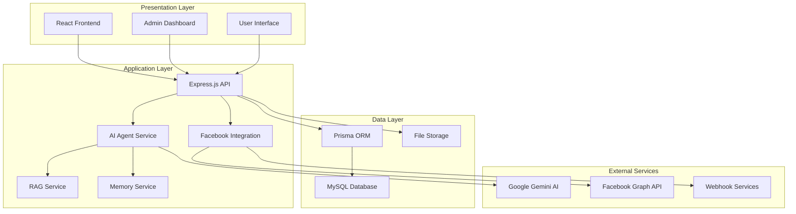
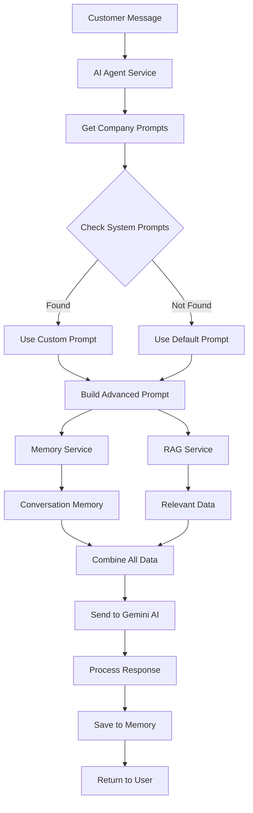
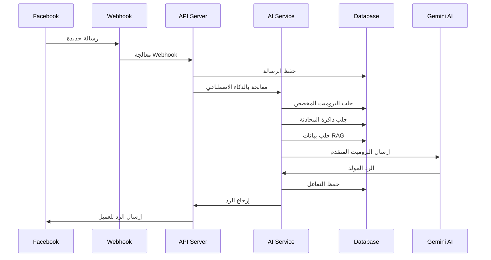
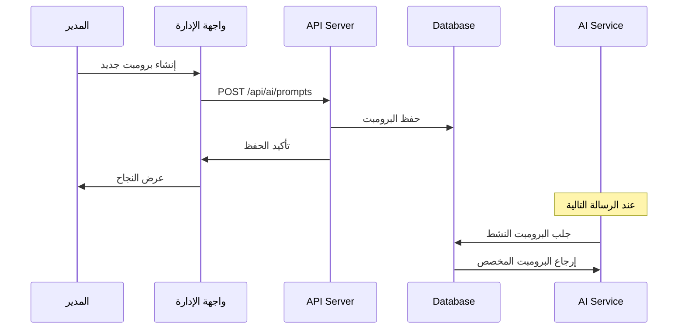
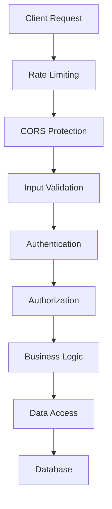
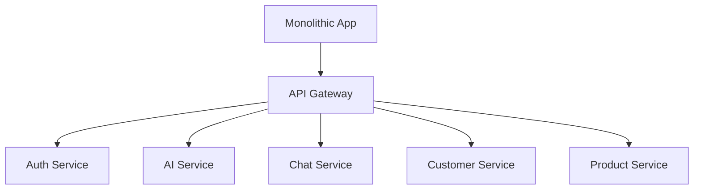

# 🏗️ بنية النظام المعمارية
## System Architecture Documentation

## 📐 **نظرة عامة على البنية**

النظام مبني على بنية **ثلاثية الطبقات (3-Tier Architecture)** مع إضافة طبقة الذكاء الاصطناعي، مما يوفر فصل واضح بين المكونات وسهولة في الصيانة والتطوير.



## 🎯 **الطبقات الأساسية**

### **1. طبقة العرض (Presentation Layer)**

#### **Frontend Application**
```typescript
src/
├── components/          # مكونات React قابلة للإعادة
│   ├── ui/             # مكونات واجهة المستخدم الأساسية
│   ├── forms/          # نماذج الإدخال
│   ├── charts/         # مخططات وإحصائيات
│   └── layout/         # مكونات التخطيط
├── pages/              # صفحات التطبيق
│   ├── Dashboard/      # لوحة التحكم
│   ├── Conversations/ # إدارة المحادثات
│   ├── Customers/     # إدارة العملاء
│   ├── Products/      # إدارة المنتجات
│   └── Settings/      # الإعدادات
├── hooks/              # React Hooks مخصصة
├── services/           # خدمات API
├── store/              # إدارة الحالة (Zustand)
├── types/              # تعريفات TypeScript
└── utils/              # وظائف مساعدة
```

#### **المسؤوليات:**
- عرض البيانات للمستخدم
- التفاعل مع المستخدم
- إرسال الطلبات للـ API
- إدارة حالة التطبيق

### **2. طبقة التطبيق (Application Layer)**

#### **API Server Structure**
```javascript
backend/src/
├── routes/             # مسارات API
│   ├── auth.js        # المصادقة والترخيص
│   ├── conversations.js # إدارة المحادثات
│   ├── customers.js   # إدارة العملاء
│   ├── products.js    # إدارة المنتجات
│   ├── ai.js          # إعدادات الذكاء الاصطناعي
│   └── webhooks.js    # معالجة Webhooks
├── services/          # خدمات الأعمال
│   ├── aiAgentService.js      # خدمة الذكاء الاصطناعي
│   ├── ragService.js          # خدمة RAG
│   ├── memoryService.js       # خدمة الذاكرة
│   ├── facebookService.js     # تكامل فيسبوك
│   └── orderService.js        # إدارة الطلبات
├── middleware/        # وسطاء Express
│   ├── auth.js       # التحقق من المصادقة
│   ├── validation.js # التحقق من البيانات
│   └── logging.js    # تسجيل العمليات
├── utils/            # وظائف مساعدة
└── config/           # إعدادات النظام
```

#### **المسؤوليات:**
- معالجة منطق الأعمال
- التحقق من صحة البيانات
- إدارة المصادقة والترخيص
- التكامل مع الخدمات الخارجية

### **3. طبقة البيانات (Data Layer)**

#### **Database Schema**
```sql
-- الجداول الأساسية
Users                   # المستخدمين
Companies              # الشركات
Customers              # العملاء
Conversations          # المحادثات
Messages               # الرسائل
Products               # المنتجات
Orders                 # الطلبات

-- جداول الذكاء الاصطناعي
SystemPrompts          # البرومبتات المخصصة
AISettings             # إعدادات الذكاء الاصطناعي
GeminiKeys            # مفاتيح Gemini API
ConversationMemory    # ذاكرة المحادثات
FAQs                  # الأسئلة الشائعة

-- جداول النظام
FacebookPages         # صفحات فيسبوك
Webhooks             # إعدادات Webhooks
AuditLogs            # سجل العمليات
```

## 🤖 **نظام الذكاء الاصطناعي**

### **AI Agent Service Architecture**



### **مكونات نظام الذكاء الاصطناعي:**

#### **1. AI Agent Service**
```javascript
class AIAgentService {
  // الوظائف الأساسية
  async processCustomerMessage(messageData)
  async getCompanyPrompts(companyId)
  async buildAdvancedPrompt(...)
  async generateResponse(...)
  
  // تحليل الرسائل
  analyzeIntent(message)
  analyzeSentiment(message)
  
  // إدارة الذاكرة
  async saveInteraction(...)
  async getConversationMemory(...)
}
```

#### **2. RAG Service (Retrieval-Augmented Generation)**
```javascript
class RAGService {
  // البحث والاسترجاع
  async retrieveRelevantData(query, intent, customerId)
  async searchProducts(query)
  async searchFAQs(query)
  async searchPolicies(query)
  
  // إدارة قاعدة المعرفة
  async initializeKnowledgeBase()
  async updateKnowledgeBase()
}
```

#### **3. Memory Service**
```javascript
class MemoryService {
  // إدارة الذاكرة
  async saveInteraction(interactionData)
  async getConversationMemory(conversationId, senderId, limit)
  async clearOldMemories()
  
  // تحليل السياق
  async analyzeConversationContext(...)
  async getCustomerHistory(customerId)
}
```

## 🔄 **تدفق البيانات**

### **1. تدفق الرسائل الواردة**



### **2. تدفق إدارة البرومبت**



## 🔐 **الأمان والحماية**

### **طبقات الأمان**



### **آليات الحماية:**

#### **1. المصادقة والترخيص**
- **JWT Tokens**: مصادقة آمنة
- **Role-based Access Control**: صلاحيات حسب الدور
- **Session Management**: إدارة الجلسات

#### **2. حماية البيانات**
- **Input Sanitization**: تنظيف المدخلات
- **SQL Injection Prevention**: منع هجمات SQL
- **XSS Protection**: حماية من XSS

#### **3. مراقبة النظام**
- **Audit Logging**: تسجيل العمليات
- **Error Tracking**: تتبع الأخطاء
- **Performance Monitoring**: مراقبة الأداء

## 📊 **إدارة الأداء**

### **استراتيجيات التحسين:**

#### **1. Database Optimization**
```sql
-- فهرسة الجداول المهمة
CREATE INDEX idx_conversations_customer ON conversations(customerId);
CREATE INDEX idx_messages_conversation ON messages(conversationId);
CREATE INDEX idx_system_prompts_active ON system_prompts(isActive);
```

#### **2. Caching Strategy**
```javascript
// تخزين مؤقت للبيانات المتكررة
const cache = {
  prompts: new Map(),
  customerData: new Map(),
  ragData: new Map()
};
```

#### **3. Connection Pooling**
```javascript
// تجميع اتصالات قاعدة البيانات
const prisma = new PrismaClient({
  datasources: {
    db: {
      url: process.env.DATABASE_URL,
    },
  },
  log: ['query', 'info', 'warn', 'error'],
});
```

## 🔧 **إعدادات النشر**

### **بيئات النشر:**

#### **Development Environment**
```yaml
# docker-compose.dev.yml
version: '3.8'
services:
  frontend:
    build: ./frontend
    ports:
      - "3000:3000"
    environment:
      - NODE_ENV=development
  
  backend:
    build: ./backend
    ports:
      - "3001:3001"
    environment:
      - NODE_ENV=development
      - DATABASE_URL=mysql://...
  
  database:
    image: mysql:8.0
    environment:
      - MYSQL_ROOT_PASSWORD=password
```

#### **Production Environment**
```yaml
# docker-compose.prod.yml
version: '3.8'
services:
  frontend:
    build: 
      context: ./frontend
      dockerfile: Dockerfile.production
    environment:
      - NODE_ENV=production
  
  backend:
    build:
      context: ./backend
      dockerfile: Dockerfile.production
    environment:
      - NODE_ENV=production
```

## 📈 **قابلية التوسع**

### **استراتيجيات التوسع:**

#### **1. Horizontal Scaling**
- **Load Balancers**: توزيع الأحمال
- **Multiple Instances**: عدة نسخ من الخادم
- **Database Clustering**: تجميع قواعد البيانات

#### **2. Microservices Migration**


---

## 📞 **المراجع والدعم**

- [دليل التطوير](../development/DEVELOPMENT_SETUP.md)
- [توثيق API](../api/README.md)
- [دليل النشر](../deployment/DEPLOYMENT_GUIDE.md)
- [حل المشاكل](../troubleshooting/COMMON_ISSUES.md)
