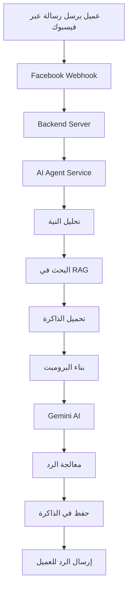

# 🏗️ نظرة عامة على النظام
## AI-Powered Customer Service Chatbot System Overview

## 📋 **ملخص النظام**

نظام خدمة العملاء الذكي هو منصة متكاملة تستخدم الذكاء الاصطناعي لتوفير خدمة عملاء تلقائية عبر فيسبوك ماسنجر. النظام يجمع بين تقنيات الذكاء الاصطناعي المتقدمة وإدارة قواعد البيانات لتقديم تجربة عملاء متميزة.

## 🎯 **الهدف الرئيسي**

توفير نظام ذكي قادر على:
- **الرد التلقائي** على استفسارات العملاء
- **فهم النية** من الرسائل
- **استرجاع المعلومات** من قاعدة البيانات
- **تذكر المحادثات** السابقة
- **التعلم المستمر** من التفاعلات

## 🏛️ **المكونات الأساسية**

### **1. الواجهة الأمامية (Frontend)**
```
React + TypeScript + Tailwind CSS
├── لوحة التحكم الإدارية
├── إدارة المحادثات
├── إدارة المنتجات
├── إدارة العملاء
├── التقارير والإحصائيات
└── إعدادات النظام
```

### **2. الخادم الخلفي (Backend)**
```
Node.js + Express + Prisma
├── API Routes
├── AI Agent Service
├── RAG Service
├── Memory Service
├── Facebook Integration
└── Database Management
```

### **3. قاعدة البيانات (Database)**
```
MySQL + Prisma ORM
├── المستخدمين والشركات
├── العملاء والمحادثات
├── المنتجات والطلبات
├── البرومبتات المخصصة
├── ذاكرة المحادثات
└── إعدادات النظام
```

### **4. الذكاء الاصطناعي (AI System)**
```
Google Gemini + Custom Logic
├── نظام البرومبت المخصص
├── RAG (Retrieval-Augmented Generation)
├── تحليل النية والمشاعر
├── ذاكرة المحادثات
└── التعلم المستمر
```

## 🔄 **تدفق العمل الأساسي**



## 🎨 **الميزات الرئيسية**

### **🤖 الذكاء الاصطناعي المتقدم**
- **برومبت مخصص**: إمكانية تخصيص شخصية البوت
- **RAG System**: استرجاع المعلومات من قاعدة البيانات
- **تحليل النية**: فهم ما يريده العميل
- **ذاكرة المحادثات**: تذكر السياق السابق

### **📱 التكامل مع فيسبوك**
- **Messenger Integration**: تكامل كامل مع فيسبوك ماسنجر
- **Webhook Handling**: معالجة الرسائل في الوقت الفعلي
- **Rich Messages**: دعم الرسائل الغنية والصور

### **📊 إدارة شاملة**
- **لوحة تحكم متقدمة**: إحصائيات ومؤشرات مفصلة
- **إدارة المحادثات**: متابعة وإدارة جميع المحادثات
- **إدارة المنتجات**: إضافة وتحديث المنتجات
- **إدارة العملاء**: قاعدة بيانات شاملة للعملاء

### **🔧 المرونة والتخصيص**
- **إعدادات متقدمة**: تخصيص سلوك النظام
- **برومبتات متعددة**: إمكانية إنشاء شخصيات مختلفة
- **ساعات العمل**: تحديد أوقات عمل البوت
- **حدود الردود**: تحكم في عدد الردود لكل عميل

## 🔐 **الأمان والحماية**

### **المصادقة والترخيص**
- **JWT Tokens**: نظام مصادقة آمن
- **Role-based Access**: صلاحيات حسب الدور
- **Session Management**: إدارة الجلسات

### **حماية البيانات**
- **Data Encryption**: تشفير البيانات الحساسة
- **Input Validation**: التحقق من صحة المدخلات
- **SQL Injection Protection**: حماية من هجمات SQL

### **مراقبة النظام**
- **Logging System**: نظام تسجيل شامل
- **Error Tracking**: تتبع الأخطاء
- **Performance Monitoring**: مراقبة الأداء

## 📈 **الأداء والتوسع**

### **تحسين الأداء**
- **Database Indexing**: فهرسة قاعدة البيانات
- **Caching Strategy**: استراتيجية التخزين المؤقت
- **Connection Pooling**: تجميع الاتصالات

### **قابلية التوسع**
- **Horizontal Scaling**: التوسع الأفقي
- **Load Balancing**: توزيع الأحمال
- **Microservices Ready**: جاهز للخدمات المصغرة

## 🛠️ **التقنيات المستخدمة**

### **Frontend Technologies**
- **React 18**: مكتبة واجهة المستخدم
- **TypeScript**: لغة البرمجة المطبوعة
- **Tailwind CSS**: إطار عمل CSS
- **Vite**: أداة البناء السريعة

### **Backend Technologies**
- **Node.js**: بيئة تشغيل JavaScript
- **Express.js**: إطار عمل الخادم
- **Prisma**: ORM لقاعدة البيانات
- **Socket.io**: التواصل في الوقت الفعلي

### **AI & ML Technologies**
- **Google Gemini**: نموذج الذكاء الاصطناعي
- **Custom RAG**: نظام استرجاع مخصص
- **Vector Embeddings**: تمثيل النصوص
- **Intent Classification**: تصنيف النوايا

### **Database & Storage**
- **MySQL**: قاعدة البيانات الرئيسية
- **Redis**: التخزين المؤقت (اختياري)
- **File Storage**: تخزين الملفات

## 🎯 **حالات الاستخدام**

### **للشركات الصغيرة**
- خدمة عملاء تلقائية 24/7
- توفير التكاليف
- تحسين تجربة العملاء

### **للشركات المتوسطة**
- إدارة حجم كبير من الاستفسارات
- تحليل بيانات العملاء
- تحسين عمليات البيع

### **للشركات الكبيرة**
- تكامل مع الأنظمة الموجودة
- تخصيص متقدم
- تحليلات معمقة

## 📊 **المؤشرات والإحصائيات**

### **مؤشرات الأداء**
- معدل الاستجابة
- دقة الردود
- رضا العملاء
- معدل التحويل

### **إحصائيات الاستخدام**
- عدد المحادثات اليومية
- أكثر الاستفسارات شيوعاً
- أوقات الذروة
- معدل نجاح البوت

## 🚀 **الخطط المستقبلية**

### **الميزات القادمة**
- دعم منصات أخرى (WhatsApp, Telegram)
- تحليل المشاعر المتقدم
- ردود صوتية
- تكامل مع CRM

### **التحسينات التقنية**
- تحسين خوارزميات الذكاء الاصطناعي
- تطوير واجهة المستخدم
- تحسين الأداء
- إضافة ميزات جديدة

---

## 📞 **الدعم والمساعدة**

للحصول على مساعدة أو دعم تقني:
- راجع [دليل حل المشاكل](../troubleshooting/COMMON_ISSUES.md)
- اطلع على [الأسئلة الشائعة](../FAQ.md)
- تواصل مع فريق الدعم التقني
