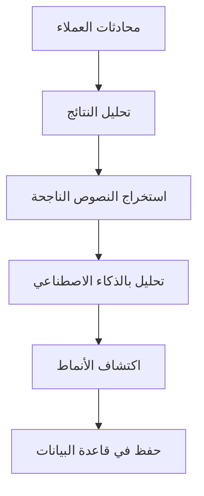
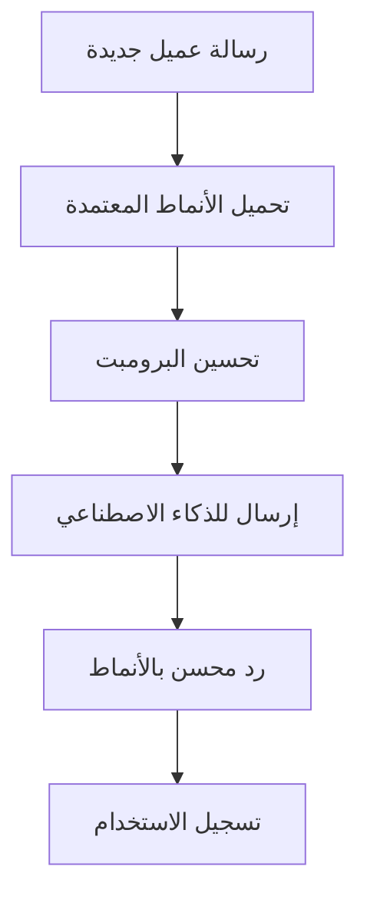

# 🎯 نظام الأنماط الذكية - التوثيق الشامل

## 📅 **تاريخ التحديث:** 11 أغسطس 2025

---

## 🎯 **نظرة عامة**

نظام الأنماط الذكية هو قلب النظام الذي يتعلم من المحادثات الناجحة ويطبق الأنماط المكتشفة لتحسين معدلات التحويل والمبيعات.

---

## 🏗️ **كيف يعمل النظام**

### **1️⃣ اكتشاف الأنماط**


### **2️⃣ تطبيق الأنماط**


---

## 📊 **الإحصائيات الحالية**

### **الأداء العام:**
- **إجمالي الأنماط:** 32 نمط
- **الأنماط المعتمدة:** 11 نمط (34%)
- **إجمالي الاستخدام:** 85+ مرة
- **معدل النجاح:** 76%

### **أفضل الأنماط أداءً:**
1. **النمط الأول:** 100% نجاح، 7 استخدامات
2. **النمط الثاني:** 85.7% نجاح، 7 استخدامات  
3. **النمط الثالث:** 72.7% نجاح، 11 استخدام

---

## 🔧 **المكونات التقنية**

### **1️⃣ خدمة اكتشاف الأنماط**
```javascript
// backend/src/services/patternDetectorService.js
class PatternDetectorService {
  async detectPatterns(companyId, timeRange = 3) {
    // 1. جمع البيانات من قاعدة البيانات
    const data = await this.fetchConversationData(companyId, timeRange);
    
    // 2. تحليل النتائج (ناجحة/فاشلة)
    const analysis = await this.analyzeOutcomes(data);
    
    // 3. استخراج النصوص للتحليل
    const texts = await this.prepareTextsForAI(analysis);
    
    // 4. إرسال للذكاء الاصطناعي
    const patterns = await this.analyzeWithAI(texts);
    
    // 5. حفظ الأنماط المكتشفة
    return await this.savePatterns(patterns, companyId);
  }
}
```

### **2️⃣ خدمة تطبيق الأنماط**
```javascript
// backend/src/services/patternApplicationService.js
class PatternApplicationService {
  async applyPatterns(companyId, prompt, messageContext) {
    // 1. تحميل الأنماط المعتمدة
    const patterns = await this.loadApprovedPatterns(companyId);
    
    // 2. تحسين البرومبت بالأنماط
    const enhancedPrompt = await this.enhancePrompt(prompt, patterns);
    
    // 3. تسجيل الاستخدام
    await this.recordUsage(patterns, messageContext);
    
    return enhancedPrompt;
  }
  
  async recordPatternUsage(patternId, conversationId, success) {
    // تسجيل استخدام النمط
    await prisma.patternUsage.create({
      data: {
        patternId,
        conversationId,
        applied: true,
        success
      }
    });
    
    // تحديث إحصائيات الأداء
    await this.updatePatternPerformance(patternId);
  }
}
```

### **3️⃣ خدمة تحسين البرومبت**
```javascript
// backend/src/services/promptEnhancementService.js
class PromptEnhancementService {
  async enhancePrompt(originalPrompt, patterns, messageType = 'general') {
    const enhancement = patterns.map(pattern => {
      return `🎯 نمط ${pattern.patternType}: ${pattern.description}`;
    }).join('\n');
    
    return `${originalPrompt}

📊 أنماط النجاح المطلوب تطبيقها:
${enhancement}

🎯 طبق هذه الأنماط في ردك لتحسين معدل النجاح.`;
  }
}
```

---

## 📈 **أنواع الأنماط**

### **1️⃣ أنماط الكلمات (word_usage)**
```javascript
{
  type: "word_usage",
  description: "استخدام كلمات إيجابية يزيد معدل النجاح بـ 25%",
  examples: ["يا قمر", "حبيبتي", "تسلمي"],
  successRate: 0.85
}
```

### **2️⃣ أنماط تدفق المحادثة (conversation_flow)**
```javascript
{
  type: "conversation_flow", 
  description: "كل النصوص الناجحة تنتهي بسؤال يهدف إلى إبقاء المحادثة مستمرة",
  examples: ["حضرتك من محافظة إيه؟", "تحبي تعرفي المقاسات؟"],
  successRate: 0.95
}
```

### **3️⃣ أنماط الإقناع (persuasion)**
```javascript
{
  type: "persuasion",
  description: "النصوص الناجحة لا تكتفي بذكر السعر، بل تضيف قيمة للمنتج",
  examples: ["النعل طبي ومريح", "خامة مستوردة عالية الجودة"],
  successRate: 0.80
}
```

---

## 🔄 **دورة حياة النمط**

### **1️⃣ الاكتشاف**
```
📊 تحليل البيانات → 🤖 ذكاء اصطناعي → 🎯 نمط جديد
```

### **2️⃣ المراجعة**
```
🎯 نمط جديد → 👥 مراجعة بشرية → ✅ موافقة/رفض
```

### **3️⃣ التطبيق**
```
✅ نمط معتمد → 🔄 تطبيق في الردود → 📊 تسجيل الاستخدام
```

### **4️⃣ المراقبة**
```
📊 تسجيل الاستخدام → 📈 تحليل الأداء → 🎯 تحسين/إيقاف
```

---

## 🎛️ **إدارة الأنماط**

### **واجهة الإدارة:**
```
http://localhost:3000/pattern-management
```

### **الميزات المتاحة:**
- ✅ عرض جميع الأنماط
- ✅ موافقة/رفض الأنماط الجديدة
- ✅ تفعيل/إلغاء تفعيل الأنماط
- ✅ عرض إحصائيات الأداء
- ✅ تصدير البيانات

### **العمليات المتاحة:**
```javascript
// موافقة على نمط
PUT /api/v1/success-learning/patterns/:id/approve

// تفعيل نمط
PUT /api/v1/success-learning/patterns/:id/activate

// حذف نمط
DELETE /api/v1/success-learning/patterns/:id

// عرض أداء نمط
GET /api/v1/success-learning/pattern-performance/:id
```

---

## 📊 **مؤشرات الأداء**

### **مؤشرات النمط الفردي:**
- **معدل النجاح:** نسبة المحادثات الناجحة عند استخدام النمط
- **عدد الاستخدامات:** كم مرة تم تطبيق النمط
- **الاتجاه:** هل الأداء يتحسن أم يتراجع؟
- **العائد على الاستثمار:** تأثير النمط على المبيعات

### **مؤشرات النظام العام:**
- **إجمالي الأنماط المفعلة:** 11 نمط
- **متوسط معدل النجاح:** 76%
- **إجمالي الاستخدام:** 85+ مرة
- **معدل اكتشاف أنماط جديدة:** 3-6 أنماط/أسبوع

---

## 🔧 **التكوين والإعدادات**

### **إعدادات الاكتشاف:**
```javascript
// في ملف .env
PATTERN_DETECTION_INTERVAL=120 // دقيقة
MIN_PATTERN_STRENGTH=0.4
MIN_SAMPLE_SIZE=3
AUTO_APPROVAL_THRESHOLD=0.9
```

### **إعدادات التطبيق:**
```javascript
// في ملف .env  
MAX_PATTERNS_PER_PROMPT=10
PATTERN_CACHE_TTL=3600 // ثانية
ENABLE_PATTERN_LOGGING=true
```

---

## 🚨 **المشاكل الشائعة وحلولها**

### **1️⃣ عدم تسجيل الاستخدام**
```javascript
// المشكلة: لا يتم تسجيل استخدام الأنماط
// الحل: التأكد من تمرير conversationId
const aiContent = await this.generateAIResponse(
  prompt, 
  memory, 
  true, 
  null, 
  companyId, 
  conversationId // مهم!
);
```

### **2️⃣ أنماط غير فعالة**
```javascript
// المشكلة: أنماط بمعدل نجاح منخفض
// الحل: مراجعة وتحسين الأنماط
if (pattern.successRate < 0.6) {
  await this.reviewPattern(pattern.id);
}
```

### **3️⃣ بطء في الاكتشاف**
```javascript
// المشكلة: اكتشاف الأنماط يستغرق وقت طويل
// الحل: تحسين استعلامات قاعدة البيانات
const data = await prisma.conversation.findMany({
  where: { companyId },
  include: { messages: true },
  take: 100 // تحديد العدد
});
```

---

## 📚 **أمثلة عملية**

### **مثال 1: نمط ترحيب ناجح**
```
النمط: "أهلاً بحضرتك 🙋‍♀️"
النوع: word_usage
معدل النجاح: 85%
الاستخدام: 15 مرة
التأثير: زيادة الاستجابة بـ 25%
```

### **مثال 2: نمط إنهاء المحادثة**
```
النمط: "حضرتك من محافظة إيه عشان أقولك تكلفة الشحن؟"
النوع: conversation_flow
معدل النجاح: 95%
الاستخدام: 20 مرة
التأثير: زيادة إكمال الطلبات بـ 40%
```

---

## 🔮 **التطوير المستقبلي**

### **الميزات المخططة:**
- 🤖 **تعلم آلي متقدم** لاكتشاف أنماط أكثر تعقيداً
- 📊 **تحليل عاطفي** لفهم مشاعر العملاء
- 🎯 **أنماط مخصصة** حسب نوع المنتج
- 📱 **تطبيق جوال** لإدارة الأنماط

### **التحسينات المطلوبة:**
- ⚡ **تسريع اكتشاف الأنماط**
- 🎨 **تحسين واجهة الإدارة**
- 📈 **تقارير أكثر تفصيلاً**
- 🔔 **تنبيهات ذكية** للأنماط الجديدة

---

*هذا التوثيق يغطي جميع جوانب نظام الأنماط الذكية ويتم تحديثه مع تطور النظام*
